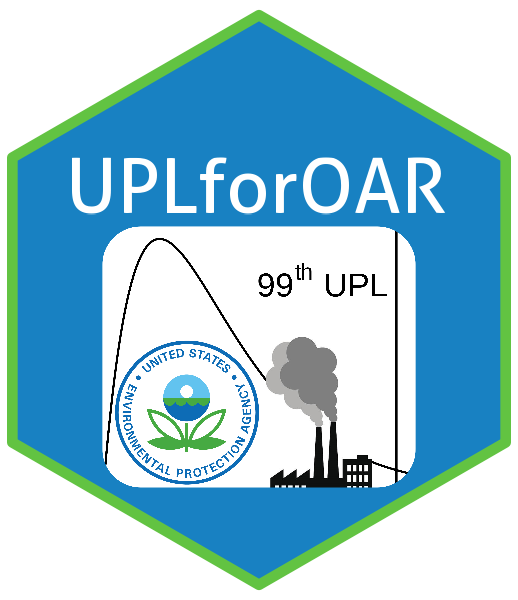

<!-- README.md is generated from README.Rmd. Please edit that file -->

```{r, include = FALSE}
knitr::opts_chunk$set(
  collapse = TRUE,
  comment = "#>",
  fig.path = "man/figures/README-",
  echo = FALSE,
  error=TRUE,
  warning=FALSE,
  message=FALSE
)
library(dplyr)
library(ggplot2)
library(tidyverse)
library(EnvStats)
library(grid)
library(np)
library(sfsmisc)
```

# UPLforOAR

<!-- badges: start -->
[](https://www.repostatus.org/#wip)
[](https://codecov.io/gh/LuddaLudwig/UPLforOAR)
[](https://github.com/LuddaLudwig/UPLforOAR/actions/workflows/R-CMD-check.yaml)
[](https://choosealicense.com/licenses/mit/)
[)`-green.svg)](/commits/main)
<!-- badges: end -->

<a href="https://github.com/LuddaLudwig/UPLforOAR"></a>


The goal of `UPLforOAR` is to provide a set of functions for supporting 
National Emissions Standards for Hazardous Air Pollutants (NESHAP) analyses. 
This includes organizing data sets for Maximum Achievable Control Technology 
(MACT) floor analysis and Upper Predictive Limit (UPL) calculations. These 
functions include selecting the best and top performing sources from emissions 
data based on appropriate Clean Air Act sections, determining the appropriate 
distributions for the emissions data, and calculating the UPL for Existing 
source Guidance (EG) and New Source Performance Standards (NSPS).

The `UPLforOAR` R package replicates all of the functionality of the UPL.xlsx 
workbook while streamlining its use. Using R instead of Excel avoids common 
sources of user-error such as copy-paste mistakes, cell-dragging, and 
inter-sheet references. Furthermore, the R package adds clarity to UPL standards 
calculations by plotting the distribution probability densities and emissions 
data underlying the methods. This allows the user to verify visually that the 
emissions data are well represented and the assumptions of the probability 
distribution are reasonable. Furthermore, `UPLforOAR` can be used through an R 
shiny app for quick and reproducible UPL calculations, and also generate pdf 
reports directly from uploading emissions data without user input required.

## Installation

You can install the most recent development version of `UPLforOAR` from 
[GitHub](https://github.com/USEPA/UPLforOAR) with: 

``` r
# install.packages("pak")
pak::pak("USEPA/UPLforOAR")
```
## Contact
If you have any questions please reach out to <Ludwig.Ludda@epa.gov>


## Example emissions data

This is example uses Hg emissions data from the recent [EPA rule-making](https://www.regulations.gov/document/EPA-HQ-OAR-2009-0234-20132) 
NESHAP for Coal- and Oil-fired Electric Utility Steam Generating Units. This 
data set contains a lot of test report information, but only columns for 
`emissions` and `sources` are needed for the MACT floor UPL analysis. The 
`emissions` and `sources` need to be named such explicitly. The emissions 
should all be in consistent units, and the sources should be unique at the 
unit-level (e.g. a single boiler), not including sub-categories. 

```{r example, echo=TRUE}
library(UPLforOAR)
dat_emiss=read_csv("man/data_example/MATS_Hg.csv",col_names=TRUE)
dat_emiss$sources=paste0(dat_emiss$`Plant Name`,"_",dat_emiss$`Unit Number`,
                         "_",dat_emiss$boiler_id)
dat_emiss$emissions=dat_emiss$Mercury_min_lb_MMBtu
dat_emiss=subset(dat_emiss,select=c(sources,emissions))
nrow(dat_emiss) # number of tests in data set
summary(dat_emiss$emissions)

dat_EG=MACT_EG(CAA_section=112,dat_emiss)
dat_EG_avg=dat_EG%>%group_by(sources)%>%
  summarize(avg=mean(emissions),counts=n())
dat_EG_avg=arrange(dat_EG_avg,avg)
distribution_result_EG=distribution_type(dat_EG)

```
```{r EG table}
knitr::kable(dat_EG_avg%>%mutate(across(c(2),~signif(.,digits=4)))%>%head(),
             caption="Top 5 of 42 sources for EG standard UPL calculation",
             col.names=c('Source','Average emission','No. of Tests'),digits=12)
```
Since there were more than 30 sources in the emissions data, the top 12% were chosen to represent the top sources. This yielded `r nrow(dat_EG)` sources. The data included in this regulatory docket were test averages as opposed to individual runs. As such the number of future runs used in UPL calculations will be 1 instead of the default, an average of 3 runs. The appropriate distribution for the UPL calculation is `r distribution_result_EG`.
```{r UPL, echo=TRUE}
UPL_EG=Lognormal_UPL(data=dat_EG,
                     future_tests = 1,
                     significance=0.99)
```
Next we calculate the UPL using the appropriate distribution, which results in a MACT floor standard of `r UPL_EG` lb/MMBtu in Hg emissions. Lastly, we will want to plot observation density of emissions data as well as the `r distribution_result_EG` distribution that was used to as the probability density function for the UPL calculation. 
```{r distr, echo=TRUE}
# make an ordered sequence of emissions 
# for which we will define the probability density
x_hat=seq(0,3*max(dat_EG$emissions),length.out=1024)
# next define the probability density along x_hat
# and at each emission observation.
obs_dens_results=obs_density(dat_EG,xvals=x_hat)
Obs_onPoint=obs_dens_results$Obs_onPoint
obs_den_df=obs_dens_results$obs_den_df
# create a probability density function along the same x_hat
# based on estimated distribution parameters
pdf_ln=dlnorm(x_hat,mean=log(mean(dat_EG$emissions,na.rm=T)),
              sd=sd(log(dat_EG$emissions),na.rm=T))
pred_dat=tibble(x_hat,pdf_ln)
```
```{r plot1, echo=TRUE, fig.dim=c(5,4), fig.cap="Observation density of Hg for the overall population. The obseration data are indicated in black as points and a rug along the axis, with the observation density distribution as a black line. The fitted lognormal distribution that is the basis of the UPL estimate is colored purple. The average of the Hg emissions is the vertical black line and the UPL result is the vertical purple line."}
ggplot()+
  geom_line(data=obs_den_df,aes(y=ydens,x=(x_hat),color='a'),size=0.75)+
  geom_area(data=obs_den_df,aes(y=ydens,x=(x_hat),fill='a'),alpha=0.25)+
  geom_point(aes(y=ydens,x=(emissions)),data=Obs_onPoint,
             size=3,alpha=0.5,shape=19,color='black')+
  geom_line(aes(y=pdf_ln,x=(x_hat),color='b'),
               data = pred_dat,size=0.75,linetype=2)+
  geom_area(aes(y=pdf_ln,x=(x_hat),fill='b'),alpha=0.25,
            data = pred_dat)+
  ylab("Density")+xlab("Hg emissions (lb/MMBtu)")+
  ggtitle("Overall observed population")+
  pop_distr_theme()+
  geom_vline(aes(xintercept=(mean(dat_EG$emissions)),
                 color='a'),size=1,linetype=1)+
  geom_vline(aes(xintercept=(UPL_EG),color='b'),size=1,linetype=2)+
  scale_x_continuous(expand=expansion(mult=c(0,0.05)))+
  scale_y_continuous(expand=expansion(mult=c(0,0.05)))+
  coord_cartesian(clip='off')+
  labs(color='Distribution:',fill='Distribution:')+
  geom_rug(sides='b',aes(x=(emissions)),data=dat_EG,
           alpha=0.5,outside=TRUE,color='black')+
  scale_color_manual(values=c('black','#984EA3'),
                     labels=c('Observations','Lognormal'))+
  scale_fill_manual(values=c('black','#984EA3'),
                    labels=c('Observations','Lognormal'))

```

## Disclaimer

The United States Environmental Protection Agency (EPA) GitHub project code is provided on an "as is" basis and the user assumes responsibility for its use.  EPA has relinquished control of the information and no longer has responsibility to protect the integrity , confidentiality, or availability of the information.  Any reference to specific commercial products, processes, or services by service mark, trademark, manufacturer, or otherwise, does not constitute or imply their endorsement, recommendation or favoring by EPA.  The EPA seal and logo shall not be used in any manner to imply endorsement of any commercial product or activity by EPA or the United States Government.

