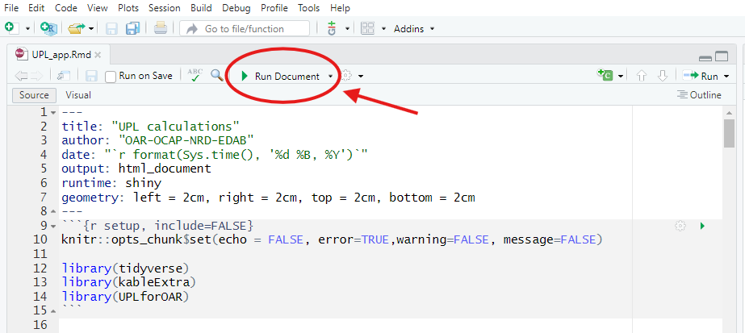
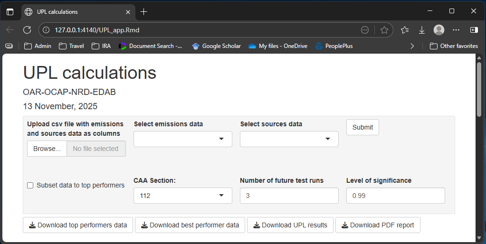
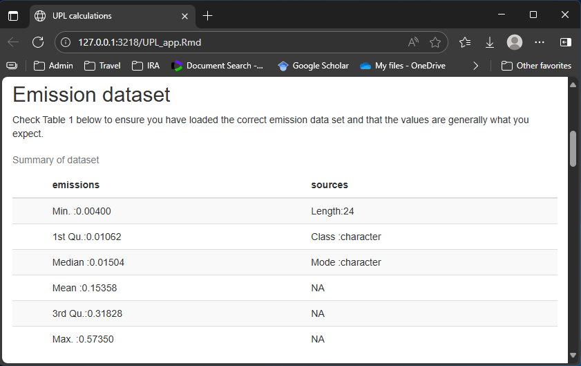
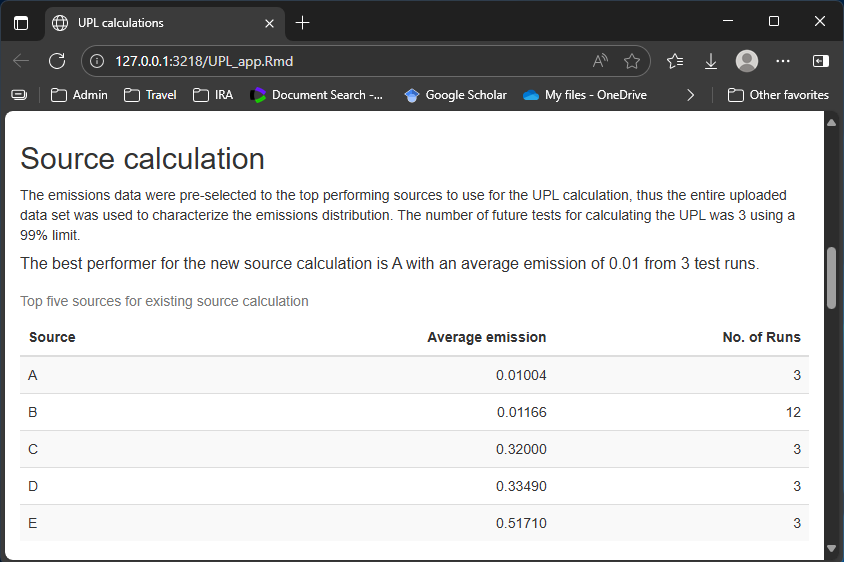
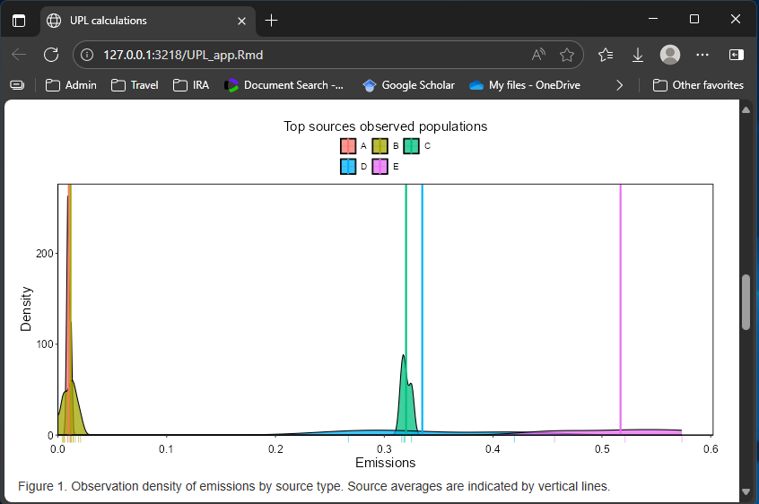
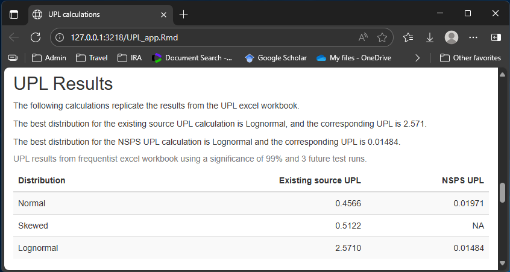
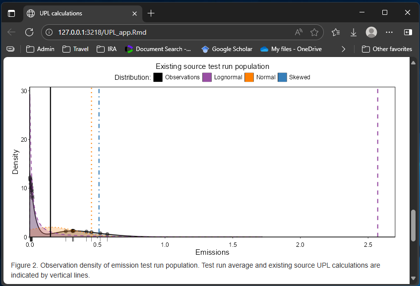
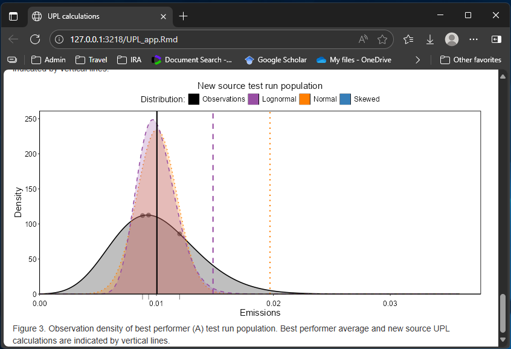
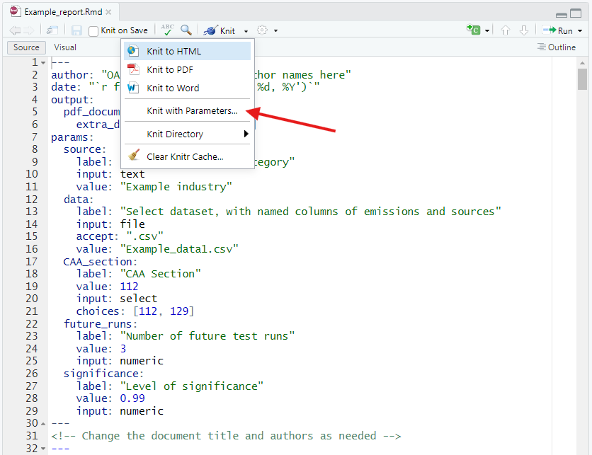

```{r, include = FALSE}
knitr::opts_chunk$set(
  echo = FALSE, 
  error=TRUE,
  warning=FALSE,
  message=FALSE,
  collapse = TRUE,
  comment = "#>",
  fig.align = "center"
)
library(htmltools)
knitr::knit_hooks$set(imgcenter = function(before, options, envir){
  if (before) {
    HTML("<p align='center'>")
  } else {
    HTML("</p>")
  }
})
```

```{r setup}
library(UPLforOAR)
```

## Introduction

This article is meant as a quick guide to using the shiny app and templates 
accompanying the `UPLforOAR` package. Rmarkdown files for the shiny app and all 
templates are located in the `inst` folder in the package directory. It will be easier to access these by downloading directly from [github](https://github.com/LuddaLudwig/UPLforOAR/tree/main/inst). 
Make sure to keep the shiny app UPL_app.Rmd in the same location as the [templates folder](https://github.com/LuddaLudwig/UPLforOAR/tree/main/inst/templates) 
with its contents included, since the shiny app and report templates use relative paths to find each other.

A couple quick notes about the shiny app and `UPLforOAR` package in general:

 - Outliers are neither checked for nor removed.
 - Units are not checked or used. It is assumed all of your data are in the same units.
 - Be careful with data that are very small numbers or very close to 1, e.g. 99.9999997\%. 
 High precision is required to handle data like that, or to do any operations 
 such as adding or subtracting a very very tiny number from a much larger one. 
 This is an issue whether using R or Excel, and certain '.csv' data formats have 
 less precision than others. There are packages in R designed specifically to help 
 in these circumstances, such as [`Rmpfr`](https://cran.r-project.org/web/packages/Rmpfr/vignettes/Rmpfr-pkg.pdf), 
 but they will need to be implemented by the user.

## Shiny app

```{r fig1, out.width="80%", fig.cap="Click the green play button to run the app. This will launch the html in your browser."}

```

Launching UPL_app.Rmd file runs an interactive html output to your browser using 
shiny and Rmarkdown. At the moment, your computer will be serving as the back end, 
running all of the R code and rendering the html output. As such, you will need 
R installed as well as `UPLforOAR` and all of its dependencies. Eventually, the 
`UPLforOAR` shiny app will deployed using a server as the back end, and you would 
visit the website instead of launching the .Rmd file. 

```{r fig2, out.width="80%", fig.cap="Input options and default settings."}

```

The panel across the top of the page will include several input options. First, 
upload your emissions data as a .csv file. Your data need to include a named 
`emissions` column of numeric values and a corresponding column named `sources`. 
Each row should be a single run emission observation and its source. Runs from 
the same source need to have an identical source name. Next choose the Clean Air 
Act section which applies to your emissions data, either 129 for hazardous waste 
combustion or 112 for everything else. If you uploaded all emissions observations 
for your pollutant you will want to check the box to subset to top performers. 
This will automatically use the correct CAA section to rank the sources and select 
the correct number of top performers. If you are using data that were pre-selected 
to the population you want to use for the UPL calculation, leave this unchecked 
and all of the data uploaded will be included. Lastly, you can set the number of 
future test runs and level of significance. For the most part, you will want to 
leave these at their default values of 3 and 0.99 respectively. 

Once you have uploaded data it will take a moment to calculate and render the 
results. The environment is reactive, meaning anytime you change any inputs in 
the browser, the results will recalculate using the changed inputs.

Below the input panel there are several download buttons. Once your uploaded data 
has been processed, you will be able to download .csv files with the subsetted 
top performing sources, the best performer, and a table with the UPL results. 
The EG and NSPS emission datasets will be named similarly to your uploaded data, 
with the same emissions and sources columns, and an additional column named 
`ln_emiss` with log-transformed emissions. The UPL spreadsheet will include all 
of the UPL calculations for both existing and new source (if applicable) for 
Normal, Lognormal, and Skewed. 

The last download button will take your data and input selections and generate a 
PDF report. This uses 'App_report_template.Rmd' and its child .Rmd files in the 
'App_report_children' folder in the templates directory to render the PDF. 
Generating PDF's from Rmarkdown documents requires the user to have some version 
of LaTex installed (MikTex for windows). 

```{r fig3, out.width="80%", fig.cap="Examine a summary of your uploaded data."}

```

The first result you will see on the shiny app is a summary of the emissions 
data you uploaded. This should include summary statistics of the `emissions` 
data, which you should check make sense with what you are expecting. This should 
also include a `sources` variable described as Class: character with a length 
corresponding to the number of rows in your uploaded dataset. 

```{r fig4, out.width="80%", fig.cap="Source selection."}

```

Next we will see a brief description of how the sources were handled. This will 
be different depending on whether or not you checked the box to have the app 
subset to the top-performers. You will also see a table of the top five sources 
with the lowest emissions, their average emissions, and the number of runs 
within each source. Check to make sure these values are in line with expectations.

```{r fig5, out.width="80%", fig.cap="Densities of top performing sources."}

```

If you have multiple runs per source you will see a figure with the observation 
densities of emissions for each sources in your set of top performers for existing source 
standard calculations. Each source will have a different color with a vertical 
line indicating the source mean emission. This figure is provided to give you an 
idea of inter- and intra-source variability in emissions.

```{r fig6, out.width="80%", fig.cap="UPL results."}

```

The UPL results reported in the shiny app use the methods from the old UPL Excel 
workbook, implemented via the `Normal_UPL()`, `Lognormal_UPL()`, and 
`Skewed_UPL()` functions in `UPLforOAR`. All of the UPL results are included in 
the table, and the text above will also report which distribution is the best 
choice via the function `distribution_type()`, and its corresponding UPL result. 
If you have less than 3 emission observations for the new source calculation those UPL 
results will be omitted. The Skewed function `Skewed_UPL()` requires greater 
than 3 observations to calculate the UPL. 

```{r fig7, out.width="80%", fig.cap="Observation density of existing source emissions population."}

```

Each emission observation is considered independent, regardless of its source, 
time, or test. Using the appropriate probability distribution to calculate the 
UPL relies on matching the density of observations for the top performing 
sources to the most similar probability distribution. The `distribution_type()` 
function uses ratios of skewness and kurtosis to distinguish between Normal, 
Lognormal, and Skewed, but it is also a good idea to check visually. The next 
figure plots the observation density in black with the emissions as both points 
and a rug under the x-axis, and the mean of the data as a vertical black line. 
The Normal and Lognormal probability densities that correspond to the means and 
variances used in the UPL calculations are plotted in orange and purple. The 
Skewed probability distribution does not have an analytical estimation of its 
parameters, so its curve is not included here. The UPL results are plotted as 
vertical lines of orange, purple, and blue for Normal, Lognormal, and Skewed 
respectively. 

Note that the density figures are plotted with the understanding that zero 
emissions is a hard boundary: that is, there is zero probability of having a 
negative emission. This lower boundary is *not* accounted for in the UPL 
functions and distribution selection criteria from the Excel workbook. 

```{r fig8, out.width="80%", fig.cap="Observation density of new source emissions population."}

```

Lastly, a similar figure for the new source emissions population is plotted (assuming 
there are at least 3 runs in the data set).

## Templates

### App_report_template.Rmd

This template is meant to create a static output as a PDF from the shiny app. 
All of the results in the PDF report will be determined from the inputs in the 
browser at the time the 'Download PDF report' was clicked. Different types of 
text or figures will be included in the report depending on the type of data 
uploaded and inputs selected in the shiny app. To handle these conditional 
circumstances, child .Rmd documents are stored for reference in the folder 
'App_report_children'. 

In addition to the summaries, figures, and tables of results that are displayed 
in the shiny app, the report will also include several appendices. Appendix A is 
a table of all of the emissions data used in the existing source UPL calculation. Appendix B 
is a table of all of the emissions data used in the new source UPL calculation. 
Appendix C contains the function code in the `UPLforOAR` version used in the 
shiny app to perform the calculations in the report. Appendix D lists the 
session info of the computer and environment that ran the calculations in the 
report. This includes the R version, `UPLforOAR` version, and the version info 
for its dependencies and any other packages loaded. Appendix E contains the R 
code chunks run in the generation of this report.

This template is meant to be generic so that it makes sense with any emissions 
data uploaded while using the shiny app. As such, no axes labels include units 
and it is assumed the user has correctly uploaded emissions data all in the same 
units. 

### convergence_template.Rmd

This template is called by `Bayesian_UPL()` when the argument `convergence_report = TRUE`. 
While `Bayesian_UPL()` is fitting the probability distributions it will call 
`converge_figs()` to generate a pair of figures for every parameter for every 
distribution called in the function. See `vignette('Convergence-and-Priors')` 
for more details on the convergence figures themselves. The template is a fairly 
simple Rmarkdown document that combines the figures with a short description and 
the current package version used to generate them. This is meant to be a tool 
for quickly checking all of your convergence results at once. For including 
convergence figures in a final report it is better to use `converge_figs()` 
directly to generate the figures as a `ggplot` object.

### Reports for Memorandum Reg Text

The shiny app and PDF report generated from it are designed to quickly provide 
UPL results with little need for input from the user. As such, there also isn't 
any customization in the text. Once the data set, distribution choice, and any 
parameters are finalized, you might want to create a PDF report with more 
content and text specific to your industry, source, or rule. You can generate 
your results and figures using the `UPLforOAR` package within any R script and 
copy the results where desired. Alternatively, you can use one of the Rmarkdown 
example reports included in the templates folder, such as Example_report.Rmd. 

```{r fig9, out.width="80%", fig.cap="In the Example_report.Rmd, click kniw with parameters to create the PDF."}

```

To use this template, click "knit with parameters". This will pop up a window 
allowing you to upload your data and change the significance, number of future 
test runs to use, select the correct Clean Air Act section to use, and include 
the name of your source category. Much like the README.Rmd and the package 
vignettes, these templates include the analysis and text using an example 
emissions data set. However, these templates are designed to be copied and then 
customized to the specific rule or pollutant, with the places where you might 
want to make text changes pointed out in italics. Often more than one hazardous air 
pollutant or multiple subcategories will be in the same report. In those cases, 
you will want to copy the relevant code blocks for each new analysis. Optional 
example text from past MACT floor analysis memorandums is included that can be 
expanded on or changed as needed. These example reports also include appendices 
with the data, functions, code blocks, and software version for reference. 
Having the code run inside the same document that produces the report is a clean 
way to prevent copy-paste mistakes or results becoming unlinked from the 
conditions that produced them.
